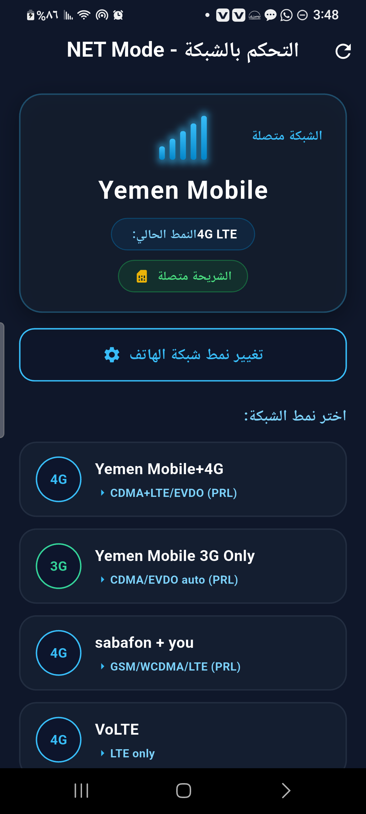
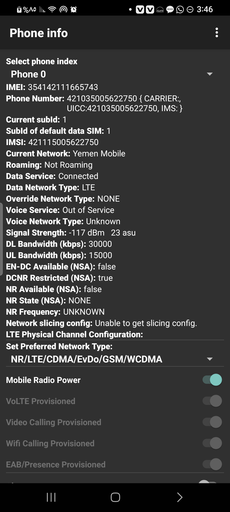
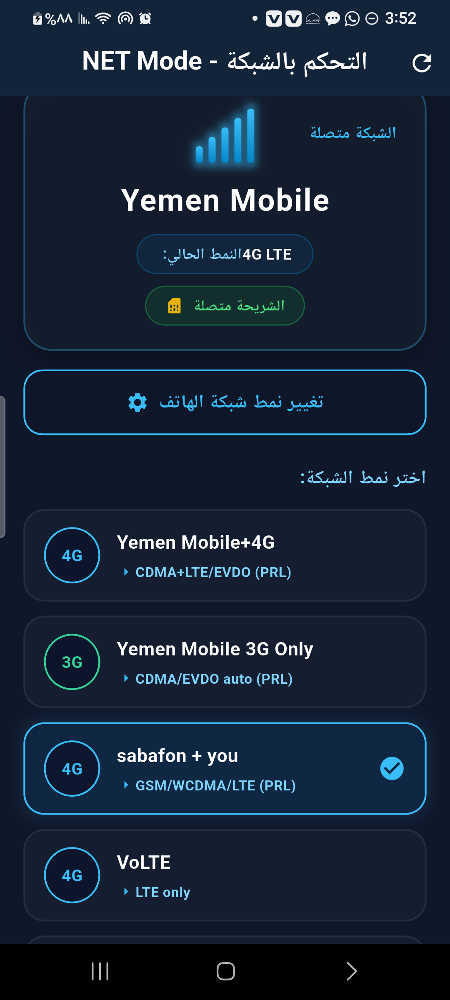

<div align="center">

  <h1>📡 NET Mode (Advanced Cellular Radio Testing Suite)</h1>
  <p><strong>تطبيق هندسي متقدم لإدارة وتثبيت أنماط شبكات الهاتف الخلوي في اليمن وفق معمارية Clean Architecture ومبادئ SOLID</strong></p>

  <p>
    <a href="https://flutter.dev"></a>
    <a href="https://dart.dev"></a>
    <a href="https://kotlinlang.org"></a>
    <a href="https://developer.android.com"></a>
    <a href="#"></a>
    <a href="#"></a>
    <a href="#"></a>
  </p>

  <p>
    <a href="#-نظرة-عامة-عن-المشروع-overview">نظرة عامة</a> •
    <a href="#-المعمارية-البرمجية-architecture">المعمارية</a> •
    <a href="#-أنماط-الشبكات-اليمنية-yemen-presets">الأنماط الخلوية</a> •
    <a href="#-شاشات-التطبيق-screenshots">شاشات التطبيق</a> •
    <a href="#-فريق-العمل-الهندسي-engineering-team">فريق العمل</a> •
    <a href="#-التثبيت-والتشغيل-installation">التثبيت والتشغيل</a>
  </p>

</div>

---

## 📖 نظرة عامة عن المشروع (Overview)

يعاني مستخدمو ومطورو الهواتف الذكية في الجمهورية اليمنية من تذبذب اتصال شبكات الهاتف وتراجع أجيال الاتصال تلقائياً (من **4G LTE** إلى **3G** بطيء) أثناء تصفح الإنترنت أو المكالمات، وتزداد هذه المشكلة تعقيداً بسبب التنوع التقني للمشغلين المحليين:
- **يمن موبايل (Yemen Mobile):** تعمل بتقنية **CDMA / EVDO** مع شبكة **4G LTE**.
- **سبأفون و يو (Sabafon & YOU):** تعملان بمعايير **GSM / UMTS / LTE**.

علاوة على ذلك، تقوم أنظمة أندرويد الحديثة (وخاصة أجهزة سامسونج ذات واجهة **One UI**) بحظر كود الفحص السري `*#*#4636#*#*` وحرمان المستخدم من إمكانية تثبيت شبكة الفورجي فقط من قائمة الإعدادات.

يقدم تطبيق **NET Mode** حلاً برمجياً متكاملاً يتجاوز قيود الاتصال وحظر الشركات، متيحاً للمستخدم تثبيت النمط المناسب ومراقبة حية لجودة الإشارة، وضع الطيران، وبطاقة الشريحة بضغطة زر واحدة.

---

## 🏛️ المعمارية البرمجية (Clean Architecture & SOLID)

تم بناء التطبيق باتباع معمارية البرمجيات النظيفة لضمان استقلالية منطق الأعمال التامة عن أي إطار عمل أو مكتبات خارجية:

```
┌──────────────────────────────────────────────────────────┐
│             Presentation Layer (Flutter UI)              │
│       HomeScreen - _NetworkStatusCard - Mode Cards       │
└────────────────────────────┬─────────────────────────────┘
                             │  (Calls)
┌────────────────────────────▼─────────────────────────────┐
│                 Domain Layer (Pure Dart)                 │
│      Use Cases: GetSnapshot, SetMode, OpenRadio          │
│      Entities: NetworkMode, NetworkInfo, NetworkGen      │
└────────────────────────────┬─────────────────────────────┘
                             │  (Implements)
┌────────────────────────────▼─────────────────────────────┐
│                 Data Layer (Repository)                  │
│       NetworkRepositoryImpl ──▶ RadioDeviceDataSource    │
└────────────────────────────┬─────────────────────────────┘
                             │  MethodChannel ('com.netmode.app/radio')
┌────────────────────────────▼─────────────────────────────┐
│              Platform Layer (Kotlin Native)              │
│    MainActivity.kt ──▶ TelephonyManager / Settings.Global│
└──────────────────────────────────────────────────────────┘
```

### 1. طبقة النطاق (Domain Layer - Pure Dart):
- خالية 100% من استيراد مكتبات Flutter أو حزم أندرويد.
- تحتوي الكيانات: `NetworkMode`, `NetworkInfo`, `NetworkGeneration`.
- تشمل حالات الاستخدام: `GetInstantNetworkSnapshotUseCase`, `SetNetworkModeUseCase`, `OpenRadioSettingsUseCase`, `ManagePreferredModeUseCase`.

### 2. طبقة البيانات (Data Layer):
- تنفيذ المستودع `NetworkRepositoryImpl` ومصدر البيانات `RadioDeviceDataSource`.
- قناة الاتصال بالمنصة `MethodChannel` باسم: `com.netmode.app/radio`.

### 3. طبقة العرض (Presentation Layer):
- واجهة نيون عصرية (Cyberpunk Dark Navy Theme).
- عداد إشارة مكون من 5 أعمدة نيون مضيئة يتفاعل لحظياً مع البث اللاسلكي.
- دمج `WidgetsBindingObserver` مع مؤقت زمني خفيف لتحديث قراءة الشبكة فوراً عند العودة للتطبيق دون الحاجة لإعادة التشغيل.

---

## 📡 أنماط الشبكات المخصصة لليمن (Yemen Carrier Presets)

| # | النمط في التطبيق | الخيار في المودم (RadioInfo) | البيئة التقنية والهدف |
| :-: | :--- | :--- | :--- |
| **1** | **Yemen Mobile+4G** | `CDMA+LTE/EVDO (PRL)` | تثبيت ودمج الفورجي مع الثري جي ليمن موبايل لبقاء الإنترنت والمكالمات معاً. |
| **2** | **Yemen Mobile 3G Only** | `CDMA/EVDO auto (PRL)` | إجبار الهاتف على شبكة 3G فقط؛ لتوفير البطارية وفي المناطق الريفية. |
| **3** | **sabafon + you** | `GSM/WCDMA/LTE (PRL)` | مخصص لشرائح سبأفون ويو العاملة بنظام GSM مع دمج 4G و 3G. |
| **4** | **VoLTE** | `LTE only` | قفل الهاتف الصارم على 4G فقط؛ لمنع التقطيع في ألعاب الأونلاين والتحميل. |
| **5** | **(Auto)** | `NR/LTE/CDMA/EvDo/GSM/WCDMA` | الوضع التلقائي الشامل لجميع الشبكات والترددات (5G/4G/3G/2G). |

---

## 📱 شاشات التطبيق (Screenshots)

<div align="center">
  <table>
    <tr>
      <td align="center" width="33%"><b>1. واجهة التطبيق الرئيسية</b><br /><sub>NET Mode Dashboard</sub></td>
      <td align="center" width="33%"><b>2. شاشة المودم الأصلية</b><br /><sub>Phone Info / Radio Settings</sub></td>
      <td align="center" width="33%"><b>3. وضع الطيران الذكي</b><br /><sub>Defensive Airplane Mode</sub></td>
    </tr>
    <tr>
      <td align="center">
        
      </td>
      <td align="center">
        
      </td>
      <td align="center">
        
      </td>
    </tr>
  </table>
</div>

---

## 🛡️ الأمان والهندسة الدفاعية (Security & Defensive Design)

- **تجاوز حظر الكود السري (`*#*#4636#*#*`):** استدعاء نافذة `com.android.phone.settings.RadioInfo` مباشرة عبر سلسلة نيات تعاقبية (OEM Fallback Matrix) لتعمل على أجهزة Samsung, Xiaomi, و Stock Android.
- **معالجة وضع الطيران (Airplane Mode):** قراءة مؤشر `Settings.Global.AIRPLANE_MODE_ON` لمنع الإبلاغ الكاذب عن توفر الشبكة؛ حيث تنطفئ أعمدة الإشارة فوراً وتتحول الحالة إلى `وضع الطيران (غير متصلة)`.
- **دعم شرائح CDMA:** قراءة اسم المشغل عبر `SubscriptionManager` وحل مشكلة عدم بث الاسم ليظهر `Yemen Mobile` بدلاً من `No Carrier`.
- **استراتيجية التحويل المزدوجة (Hybrid Execution):** دعم التحويل الصامت المباشر في الهواتف المروّتة (Root)، والتحويل الإرشادي عبر نافذة المودم في الهواتف القياسية بدون روت.

---

## 👥 فريق العمل الهندسي (Engineering Team)

تم تطوير وتوثيق هذا المشروع الأكاديمي بواسطة نخبة من مهندسي البرمجيات:

<div align="center">
  <table>
    <tr>
      <td align="center" width="25%">
        <br />
        <sub><b>أحمد ياسين العماري</b></sub><br />
        <small>Project Lead & Native Platform Engineer</small><br />
        <a href="https://github.com/Ahmedalammari969"></a>
      </td>
      <td align="center" width="25%">
        <br />
        <sub><b>محمد الدعيس</b></sub><br />
        <small>Core Domain & Software Architect</small><br />
        <a href="https://github.com"></a>
      </td>
      <td align="center" width="25%">
        <br />
        <sub><b>يوسف خيري</b></sub><br />
        <small>Data Layer & Storage Engineer</small><br />
        <a href="https://github.com"></a>
      </td>
      <td align="center" width="25%">
        <br />
        <sub><b>مؤيد الصوفي</b></sub><br />
        <small>UI/UX & Presentation State Engineer</small><br />
        <a href="https://github.com"></a>
      </td>
    </tr>
  </table>

  <br />
  <p><b>تحت إشراف الأستاذ الدكتور:</b> <code>د.م.ساهر الهمداني</code></p>
</div>

---

## 🛠️ التثبيت والتشغيل (Getting Started)

### متطلبات التشغيل:
- إطار عمل **Flutter SDK** (الإصدار 3.16 فما فوق).
- لغة **Dart SDK** (الإصدار 3.0 فما فوق).
- بيئة **Android SDK** مع تثبيت Build Tools لنظام Android 13/14.

### خطوات التثبيت:
```bash
# 1. استنساخ المستودع
git clone https://github.com/Ahmedalammari969/NET-Mode.git
cd "NET-Mode"

# 2. تثبيت الحزم والمكتبات
flutter pub get

# 3. تشغيل الاختبارات الآلية
flutter test

# 4. بناء وتشغيل التطبيق على الهاتف المتصل
flutter run
```

---

## 📑 التوثيق والتقارير (Documentation & Reports)

* [📘 وثيقة مواصفات متطلبات البرمجيات (IEEE 830 SRS)](docs/SRS.md)
* [📗 قصص المستخدمين ومعايير القبول (User Stories)](docs/USER_STORIES.md)
* [📙 خطة سير العمل وفروع المهام (Kanban & Git Workflow)](docs/KANBAN_AND_GIT_WORKFLOW.md)

---

## 📄 الترخيص (License)

هذا المشروع مرخص ومتاح بموجب ترخيص **[MIT License](LICENSE)**.
